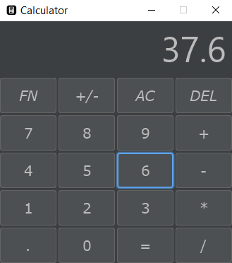

# dark-themed calculator

Has plently of useful and complex functions but should not be considered scientific

### Features

- modern look
- vanish effect
- lots of useful functions
- built with javafx

### Guide

Input a _number_ -> press [`+`, `-`, `*`, `/`] -> the number now vanishes -> input another _number_ -> either press [`=`] to display the result or continue to chain operations.

Press `FN` -> more functions that either modify the number on screen or need another number as input to finish the operation

<a href="https://github.com/mouse0w0/darculafx">Stylesheet credits</a>

> Author: xDavide9
